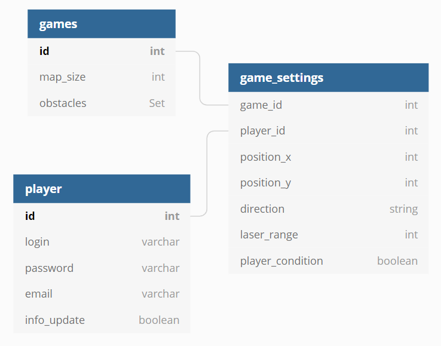

# Conception du système initial

## Système de jeu
#### Est-ce que les joueurs interagiront en temps réel, ou au tour par tour et pourquoi ?
Il sera plus simple et efficace d'implémenter un système de jeu au tour par tour car il y a beaucoup de rovers et d'obstacles en même temps sur la carte de jeu et faire en sorte que tout se passe en même temps serait assez complexe.

## Stockage des données

#### Comment sera stocké l'état (toutes les données permettant de représenter le jeu) ?
Toutes les données qui permettent de représenter le jeu seront sauvegardées dans une base de données cryptée qui interagira avec le back-end.

#### Comment seront stockées les informations confidentielles des joueurs (emails, etc.)
Les données personnelles des joueurs seront elles aussi stockées dans une base de données mais afin de protéger ces informations de personnes malveillantes, il fait 

## Gestion du jeu
#### Comment gérer plusieurs parties en même temps ?
Pour gérer plusieurs parties en même temps, il faudra récupérer l'identifiant de chaque partie afin de pouvoir associer l'ID d'un joueur avec l'ID de sa partie.
#### Comment les joueurs s'authentifieront et sauvegardent leur progression ?
Lorsqu'un utilisateur arrive sur le site du jeu, il devra s'inscrire ou se connecter au moyen d'un nom d'utilisateur et d'un mot de passe qui seront stockés dans notre base de données de joueurs. Grâce à ces informations personnelles, ils sera possible de sauvegarder leur progression dans cette même base.

## Problèmes possibles
#### Que se passera-t-il si un serveur plante ? (considérer la machine / vm / conteneur éteint(e) et inaccessible)
Si un serveur plante, il faudra que ces parties soient transférées sur un serveur de backup.
#### Comment gérer une charge imprévue ? (100x plus de joueurs que prévu par ex)
Normalement, un serveur ne peut accueillir qu'un nombre de connexions prédéfinies à l'avance donc si une charge imprévue arrive et que cela n'a pas été prévu lors de la création de celui-ci, le site deviendra indisponible. 
La solution serait de mettre en place un système de file d'attente. Si le nombre de joueurs maximum est atteint les prochains joueurs devront attendre que des joueurs quitte le site afin de pouvoir se connecter.
